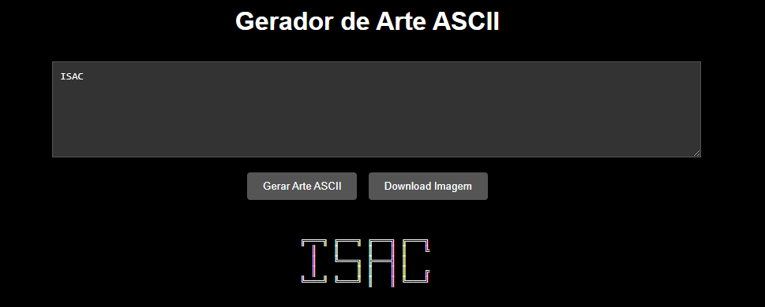

# Gerador de Arte ASCII

Um gerador web interativo que transforma texto em arte ASCII estilizada com efeito 3D/outline.



## 🚀 Funcionalidades

- Converte texto digitado em arte ASCII estilizada
- Design com efeito 3D/outline usando caracteres especiais
- Gera imagem da arte em tempo real
- Permite download da arte em formato PNG
- Interface responsiva e amigável

## 💻 Tecnologias Utilizadas

- HTML5
- CSS3
- JavaScript Vanilla
- Canvas API para geração de imagens

## 🎨 Como Usar

1. Acesse a página através do link: [Gerador Arte ASCII]([seu-link-aqui](https://github.com/isaccanedo/arte_ascii)
2. Digite o texto desejado na caixa de texto
3. Clique em "Gerar Arte ASCII"
4. Para salvar a imagem, clique em "Download Imagem"

## ⚙️ Instalação Local

1. Clone este repositório:
```bash
git clone https://github.com/isaccanedo/arte_ascii.git
